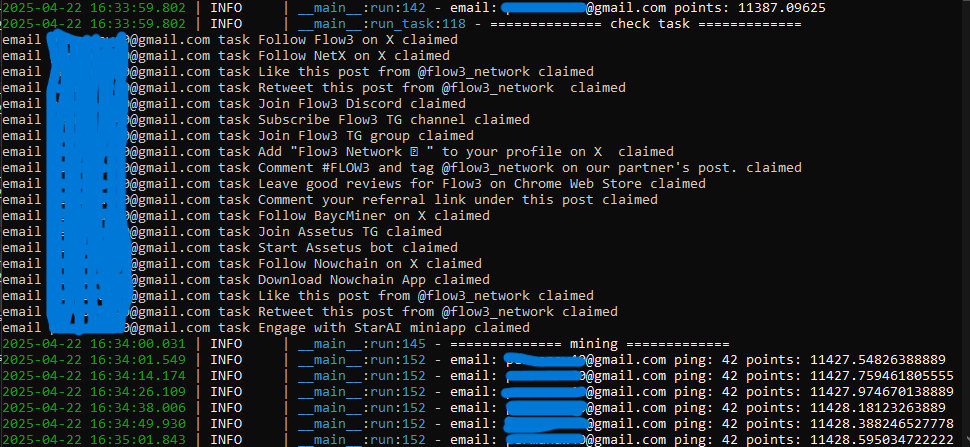
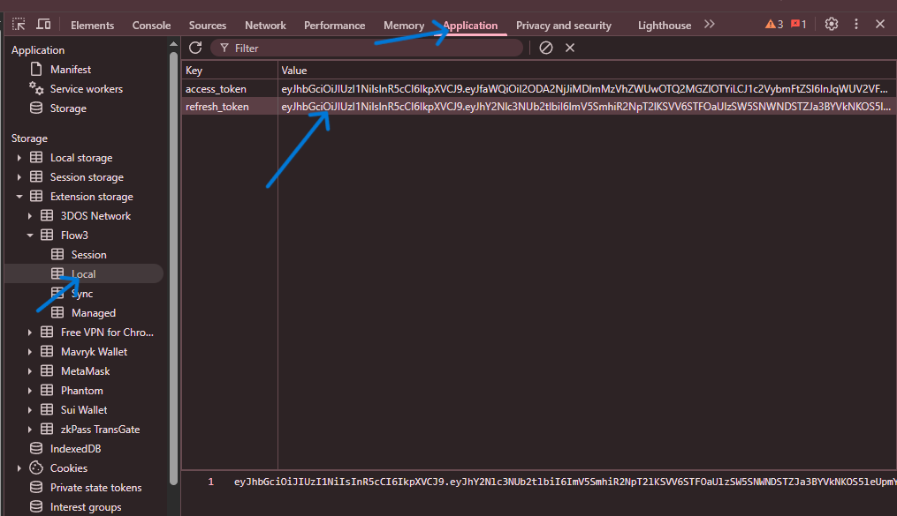

# Flow3 Auto Bot
<p align="center">
    
</p>

## Description
**Flow3 Auto Bot is an automation script to perform various tasks on the SolixDepin platform, such as registration, login, completing tasks, and mining.**
- Register : [HERE](https://app.flow3.tech/sign-up?ref=BBpc9vlkXP)

## Features
1. **Register & Referer**: Register a new account with a referrer.
2. **Clear Task**: complete available tasks.
3. **Mining**: Perform automatic mining to earn points.
4. **Batch Processing**: Process multiple accounts at once in batches using asynchronous programming.

## Requirements
- Python 3.8 or latest

## Installation
1. Clone this repository:
   ```bash
   git clone https://github.com/Fxyt/flow3.git
   cd flow3
   ```

2. Install dependencies:
   ```bash
   pip install -r requirements.txt
   ```
## Configuration
1. Create an `token.txt` file and fill RefreshToken
  - Log in to Flow3
  - Open your browser's developer tools (F12)
  - Go to the
      -> Application
      -> Extension Storage
      -> local
  like this
<p align="center">
    
</p>

2. Fill your account in accounts.json like this
   ```bash
   eyJRefreshToken...1
   eyJRefreshToken...2
   eyJRefreshToken...3
   ```

## How to use
1. Run the main script:
   ```bash
   python bot.py
   ```
   if in VPS or Linux:
   ```bash
   python3 bot.py
   ```
